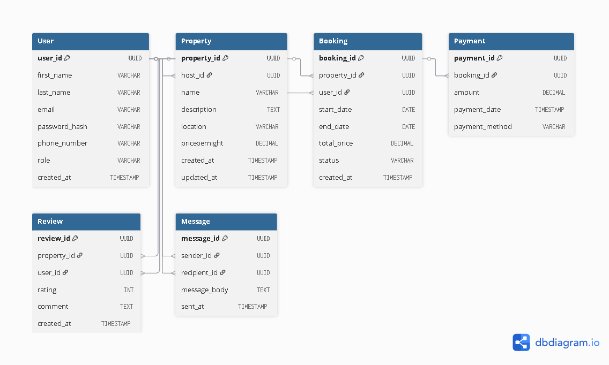

#  Define Entities and Relationships in ER Diagram

## Objective
Design an Entity-Relationship (ER) diagram for the Airbnb database based on the specification.  
The ER diagram represents entities, their attributes, and relationships.

---

## Entities and Attributes

**User**  
- user_id (PK)  
- name  
- email  
- phone  
- created_at  

**Property**  
- property_id (PK)  
- user_id (FK → User)  
- title  
- description  
- location  
- price_per_night  
- created_at  

**Booking**  
- booking_id (PK)  
- user_id (FK → User)  
- property_id (FK → Property)  
- start_date  
- end_date  
- total_price  
- status  

**Payment**  
- payment_id (PK)  
- booking_id (FK → Booking)  
- amount  
- method  
- paid_at  

**Review**  
- review_id (PK)  
- user_id (FK → User)  
- property_id (FK → Property)  
- rating  
- comment  
- created_at  

---

## Relationships
- A **User** can list many **Properties**.  
- A **User** can make many **Bookings**.  
- A **Property** can have many **Bookings**.  
- Each **Booking** is linked to one **Payment**.  
- A **User** can leave many **Reviews**.  
- A **Property** can have many **Reviews**.  

---

## ER Diagram
The ER diagram was created using [dbdiagram.io](https://dbdiagram.io/) and exported as an image.

---

